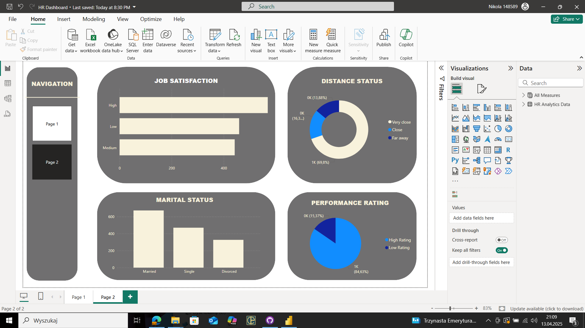

# Power-BI - HR Dashboard

This repository will contain the Power BI project of HR dataset from the following link: Google Drive (https://drive.google.com/file/d/1h4bvZlHJUFAYJ5CbleAmLr6muAX1Q7rm/view)

# Abstract

This Power BI project presents a basic dashboard analyzing employee data. This report includes key metrics such as total number of employees and gender distribution. Visualizations include bar charts and pie charts to provide clear overview of workforce structure and dmografics. The goal of the dashboard is to help HR and management gain quick insights into employee composition and support data-driven decision-making.

